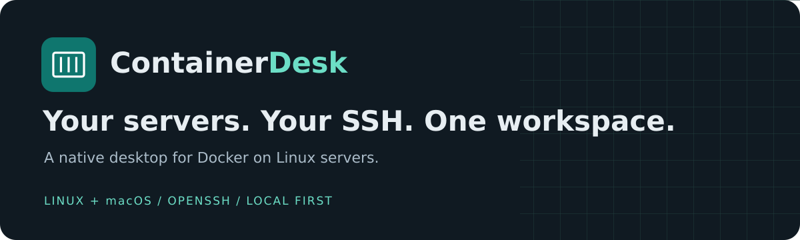

  

<h1 align="center">ContainerDesk</h1>

<strong>A native desktop for Docker over SSH.</strong> Linux + macOS · Tauri 2 · React / TypeScript · Rust / Tokio

  <a href="https://alekpopovic.github.io/container-desk/">📚 Documentation</a> ·
  <a href="https://alekpopovic.github.io/container-desk/downloads.html">⬇ Downloads</a> ·
  <a href="README_SR.md">🇷🇸 Srpski</a> ·
  <a href="CONTRIBUTING.md">🛠️ Contribute</a>

---

Connect to Docker on Linux servers through your **existing OpenSSH configuration**. Keep your keys, agent, jump hosts and strict host verification. Browse workloads in one desktop workspace, with explicit permissions for management and terminals. No local Docker Desktop, remote agent or exposed Docker TCP listener is required.

## ✨ Your remote Docker workspace

| | What you can do |
|---|---|
| ▦ **Inspect** | Browse containers, inspect details, logs, statistics, Compose groups, images, volumes and networks. |
| ⚡ **Manage** | Start, stop or restart selected containers; remove explicitly selected stopped containers without force or volume removal. |
| 🧩 **Compose** | Start, stop or restart services in verified existing projects. |
| ⌨️ **Terminal** | Open a container terminal after granting access and confirming the target. |
| 🔐 **Stay in control** | New and recovered sessions start read-only. The backend enforces management and terminal permissions. |

Images, volumes and networks are read-only in v1. Prune, Compose deployment/up/down, registry credentials, Kubernetes, telemetry and automatic updates are outside the current scope.

## 📦 Download and install

[Current downloads](docs/downloads.md) · [All releases](docs/releases.md) · [Publish a new version with existing CI](docs/release-workflow.md)

**v0.1.0 is a public unsigned preview.** Linux x86_64 and macOS Apple Silicon/Intel packages have real native execution evidence. Review the [platform matrix](docs/platform-matrix.md) for tested OS versions and limitations.

| Install on | Download |
|---|---|
| Ubuntu/Linux x86_64 | [deb](https://github.com/alekpopovic/container-desk/releases/download/v0.1.0/containerdesk-0.1.0-x86_64-unknown-linux-gnu.deb) · [AppImage](https://github.com/alekpopovic/container-desk/releases/download/v0.1.0/containerdesk-0.1.0-x86_64-unknown-linux-gnu.AppImage) |
| Mac Apple Silicon | [DMG](https://github.com/alekpopovic/container-desk/releases/download/v0.1.0/containerdesk-0.1.0-aarch64-apple-darwin.dmg) |
| Mac Intel | [DMG](https://github.com/alekpopovic/container-desk/releases/download/v0.1.0/containerdesk-0.1.0-x86_64-apple-darwin.dmg) |

[SHA256SUMS](https://github.com/alekpopovic/container-desk/releases/download/v0.1.0/SHA256SUMS) · [All assets and install instructions](https://github.com/alekpopovic/container-desk/releases/tag/v0.1.0). Mac app archives are also included. Mac packages are not Developer ID signed/notarized; Gatekeeper may block downloaded apps. See [publication receipt](docs/releases/v0.1.0.md) for exact source, hashes and download verification.

## 🚀 Get connected

1. Install the package for your operating system and verify its SHA-256 checksum.
2. Confirm that your existing SSH alias can reach the Linux Docker host with strict host-key verification and your own keys/agent.
3. Add the host in ContainerDesk, connect, and inspect containers. Enable management only when you intend to invoke an action.

Follow the [English user guide](docs/user-guide.md) or [Serbian quick start](README_SR.md) for the complete setup and troubleshooting steps.

## 📚 Explore the documentation

| Start here | Go deeper |
|---|---|
| [🧭 Documentation home](docs/README.md) | [🏗️ Architecture](codex/docs/ARCHITECTURE.md) |
| [📋 Project status](docs/project-status.md) | [🔐 Security review](docs/security-review.md) |
| [🐧 Linux packages](docs/linux-packages.md) · [🍎 macOS packages](docs/macos-packages.md) | [🧪 Verification](docs/verification-command.md) · [Integration lab](docs/integration-lab.md) |
| [🔄 Updates and rollback](docs/updates.md) | [🛠️ Development](docs/development.md) |
| [📦 Release notes](docs/RELEASE_NOTES.md) | [🎨 Brand kit](docs/branding.md) · [Website](docs/github-pages.md) |

## 🛠️ Project and contributions

Read [CONTRIBUTING](CONTRIBUTING.md) before working on the app. All 60 original implementation prompts are complete under the documented scope; [final handover](docs/FINAL_HANDOVER.md) preserves their evidence. `codex/` retains the original prompt pack and immutable task hashes. Current platform and distribution claims come from executed evidence, not task descriptions.

Native application checks are defined in `.github/workflows/ci.yml`. GitHub Pages publishes documentation from `main/docs`. The manually dispatched [release workflow](docs/release-workflow.md) reuses native CI, publishes complete installer sets, updates Downloads/Releases and explicitly rebuilds Pages. Application version is defined in `package.json`.

ContainerDesk is a working product name, not a trademark or domain-ownership claim.
