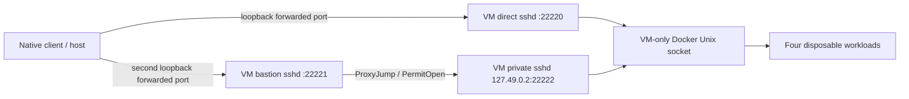

# Disposable SSH/Docker integration lab

`tests/lab/integration.py` is an explicit opt-in native Linux/macOS lab. The remote Linux VM uses KVM when available or QEMU TCG; the application backend, OpenSSH and PTY run natively on the client. It runs the application's actual Rust backend and installed native OpenSSH against a new Alpine VM with its own Docker Engine. It never invokes the host Docker client, mounts the host socket, changes host routes/firewall rules, or reads user SSH keys/configuration. The Rust executable runs with `PATH=/nonexistent`; developer tools are needed only by the harness.

## Topology



The three sshd processes have distinct ephemeral host keys. The private service listens on **the guest's loopback**, which is a different network namespace from the client host. QEMU has only two loopback-bound host forwards, neither to the private service. The harness checks that the private numeric address/port is closed before boot and during the test, verifies `ProxyJump=none` fails, and then verifies the same alias succeeds through the bastion. This is actual network isolation, unlike the older `ssh_auth.py` private DNS alias. All three servers share one disposable VM; this does not claim three independent machines or isolation from the host administrator.

Only the bastion permits local forwarding, to that exact private destination. Password/keyboard authentication, agent forwarding and X11 forwarding are disabled. Strict client trust is derived from the ephemeral server public keys before boot; config and known_hosts hashes must remain unchanged. No trust-on-first-use scan or relaxed host verification is used.

The dedicated Engine is installed in the VM itself, so Docker-in-Docker and privileged containers are unnecessary. **Any alternative that requires privileged DinD must also run inside a dedicated disposable test VM**, never on a shared development/production host. Application mutations address only the four workloads created here. Compose `up` and forced removal occur solely in fixture setup/cleanup; the application exercises only the supported existing-project operations.

## Requirements and execution

Native Linux x86_64 with writable `/dev/kvm`, Python 3, native OpenSSH and the repository's Rust build dependencies. Supply QEMU, qemu-img, SeaBIOS and genisoimage under one extracted package root, or an equivalent root layout. This run used Ubuntu packages extracted under `/tmp/containerdesk-049-tools/root`, without a system installation. Shared library dependencies are scoped to QEMU's environment, never the application process.

Use the [official Alpine cloud image](https://dl-cdn.alpinelinux.org/alpine/v3.22/releases/cloud/nocloud_alpine-3.22.4-x86_64-bios-cloudinit-r0.qcow2) and its [SHA-512 checksum](https://dl-cdn.alpinelinux.org/alpine/v3.22/releases/cloud/nocloud_alpine-3.22.4-x86_64-bios-cloudinit-r0.qcow2.sha512). The exact checksum is pinned in the runner; an unexpected image is rejected before boot. A private writable 8 GiB qcow2 overlay and NoCloud seed are generated per run. The guest gets 2 vCPUs and 2 GiB RAM. Guest package/image downloads require outbound connectivity; package versions are recorded, not claimed immutable. The workload image is digest-pinned.

```sh
python3 tests/lab/integration.py \
  --qemu-root /tmp/containerdesk-049-tools/root \
  --image /tmp/containerdesk-049-tools/alpine.qcow2 \
  --artifacts docs/verification/049-native
```

The image and tools are development caches, not tracked files. The runner fails on missing tools, occupied private endpoint, incorrect image checksum, VM startup failure or any failed assertion. It does not choose an SSH alias from the user's configuration. Run one instance at a time because the deliberate private-address negative check uses a fixed loopback port.

## Acceptance and cleanup

The ignored native Rust test is selected explicitly and checked to exist exactly once. Both direct and private paths cover handshake, exact inventory, masked inspect, finite/follow logs, cancellation, real stats, read-only denial, one-use container stop/start, verified two-service Compose restart with a space/apostrophe in its path, PTY response/resize/Ctrl-C/close, real guest SSH session termination, reconnect to a new read-only generation, and rejection of old reads/intents/input. Unknown direct and changed direct/target/bastion keys are rejected through production diagnostic classification. A real slow remote command is cancelled and reaped under the runner's two-second deadline.

Independent guest Docker CLI reads verify all four workloads remain running, the unrelated workload's start time is unchanged, and managed start times changed. The 058 extension actually stops the owned live container and deliberately loses the SSH response. The app must report unknown, perform no replay, and reconcile via a fresh read before a separate explicit start. Docker events must show exactly three starts/exits for that container, two per Compose service (one restart per transport), and zero for the untouched workload. A support export is written and read back with seeded environment/log/terminal payloads and host/container identities excluded. No automatic mutation or terminal input retry is allowed.

Guest setup has a 240-second KVM or 900-second TCG bound; the selected native suite has a 180-second KVM or 1200-second TCG bound and smaller operation deadlines. A bounded read-only daemon readiness poll precedes workload creation. Finite logs request the existing supported 30-second operation timeout; the cancellation and deliberately slow-command assertions retain their original tight bounds. SSH PID/start-time identities include ControlPersist children identified through this exact backend's held runtime leases; all observed identities must disappear after shutdown. Cleanup terminates/reaps owned client/VM process groups even on failure and removes the private temporary directory, seed, keys and overlay. On success, explicit guest container IDs are also removed and empty inventory verified before destroying the VM. VM teardown removes all guest resources on a failed run. Abrupt host power loss/SIGKILL cannot execute Python `finally`; remove only the recorded lab's QEMU process and its `containerdesk-049-*` temporary directory after independently checking ownership.

Only a sanitized result JSON is retained: versions, named checks, action counts and cleanup booleans/counts. Raw inspect/log/terminal data and seed/serial/cloud-init logs are not copied into evidence. Credentials never enter Git. These reports prove native **backend transport** only on the recorded client OS/architecture; GUI/package evidence is recorded separately in the [platform matrix](platform-matrix.md).

References: [QEMU user networking](https://www.qemu.org/docs/master/system/devices/net.html), [NoCloud local seed](https://docs.cloud-init.io/en/26.1/reference/datasources/nocloud.html). Actual versioned results are in [049-native/integration.json](verification/049-native/integration.json).

## Fresh-profile quick-start check

After `npm run desktop:build:automation`, optionally add `--quick-start-tools /path/to/native-test-tools`. The 057 extension opens a fresh native app on a private X11/DBus desktop, loads only the generated lab key into an owned agent and uses a public-only IdentityFile. It follows Settings diagnostics and Hosts browse/save/connect for direct/private routes, reads real containers/masked inspect/logs, opens then cancels a management confirmation, disconnects and checks persisted host references. It never substitutes IPC responses. Independent guest inspect must show unchanged start times before the existing backend mutation suite begins. The agent, app profile and display are removed after the walkthrough; existing VM/trust cleanup still applies. This uses the explicit automation test artifact, not a packaged production binary.

## Native CI matrix and encrypted agent

`python3 scripts/native_matrix.py` prepares the platform's QEMU tools and checksum-pinned Alpine image, then runs the full suite with `--encrypted-agent`. On macOS it uses native Homebrew QEMU, hdiutil seed creation and an architecture-matching Linux guest under TCG. ARM uses the pinned aarch64 UEFI cloud image and virtio seed media. Linux CI uses native system packages and KVM if available, otherwise TCG. No local Docker socket or production server is used.

The runner generates an encrypted throwaway identity, proves that an empty passphrase cannot read it and an empty native agent cannot authenticate, then loads it through a one-use askpass helper. SSH references only its public identity file and owned agent socket. The passphrase is never printed or placed in application environment/report data; keys, helper and socket are removed. `--provision-only` verifies prerequisites and explicitly reports `backendAcceptance: not_run`; it never satisfies native application acceptance. Do not combine `--encrypted-agent` with the separate quick-start agent mode.

A separate owned SSH master must remain alive after app shutdown. Linux samples descendant and leased-master PID/start identities; macOS samples native `ps` identities tied to policy directories whose `user.conf` symlink resolves to this exact test config, including background master's rewritten process titles. Every observed app-owned identity must be gone; the unrelated master is then closed explicitly by the harness.
